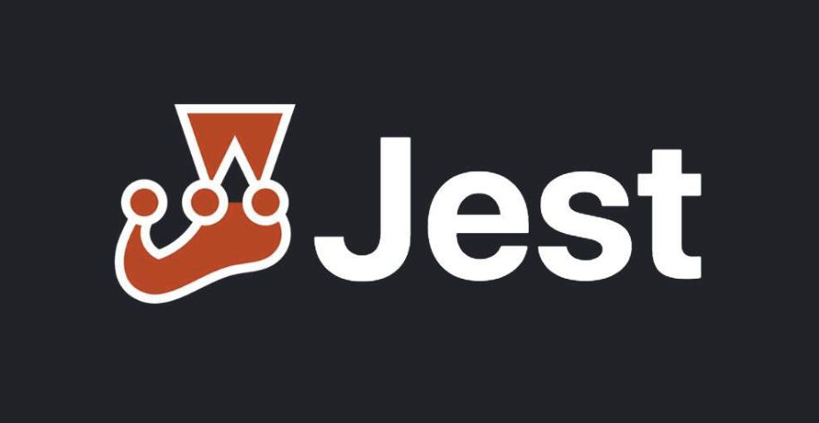

# NestJS E2E,Unit Testing + MongoDB 

> 테스팅에 대해 학습한 내용을 정리 합니다.

 

테스트 함수는 deterministic 해야한다. (언제 실행되든 항상 같은 결과를 내야한다.)

## 🌿 Unit Code 셋팅

### 1. Setting

1.  Test 파일 생성
    - 모듈 폴더 밑 **test** 폴더 생성
    - Unit 테스트할 파일 생성
      - [users.controller.spec.ts](./src/users/test/users.controller.spec.ts)
2.  공급자 파일 모킹
    - 모듈 폴더 및 **mocks** 폴더 생성
    - 주입(Provider)된 공급자 모킹 파일 생성
      - [users.service.ts](./src/users/__mocks__/users.service.ts)
        - mockResolvedValue: 비동기 함수를 모킹할 경우
        - mockReturnValue: 정적 값
      - [users.controller.ts](./src/users/users.controller.ts)
        - constructor 부분에 `DI`된 것 확인
        - QnA) 모킹한 공급자가 다른 공급자를 주입 받고 있다면 그 대상도 모킹해야되는가?
          - 아니다. 가장 높은 수준의 종속성만 모킹하면 된다.
3.  더미 데이터 생성

    - [user.stub.ts](./src/users/test/stubs/user.stub.ts)

4.  Test파일에 모킹한 공급자 연결
    - createTestingModule 함수의 providers 옵션이 `jest.mock('../users.service')`에 의해 모의된 값을 주입
    - [users.controller.spec.ts](./src/users/test/users.controller.spec.ts)

### 참고 영상

- [Nest.js E2E Testing With Supertest (Rest API + MongoDB)](https://www.youtube.com/watch?v=R2ndY_JhxWk&t=330s)

## 🌿 E2E Code 작성 방법

- [Nest.js Unit Testing | Best Practices + MongoDB](https://www.youtube.com/watch?v=1Vc6Xw8FMpg&t=335s))
