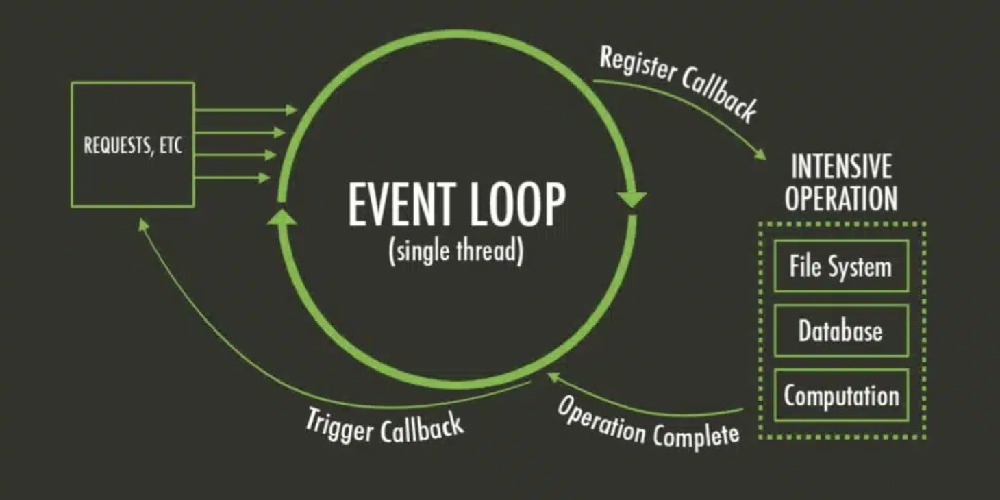
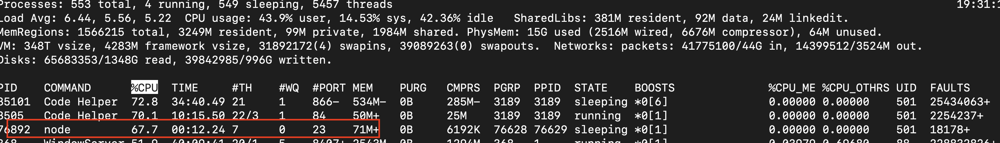

# Node basic concepts 

> [Three Concepts Every Node.js Developer Should Understand](https://www.youtube.com/watch?v=_cNIsBTg8HA&t=920s)영상을 보고 학습한 내용을 정리 합니다.

<br/>

## 🌿 목차

## 1. blocking vs non blocking

### blocking

node.js 기본적으로 동기식이고, `Single thread`를 사용한다. 떄문에 해당 쓰레드를 차단하는 코드를 작성하게 되면 다음 작업은 앞선 작업이 끝날때 까지 기다려야됩니다.

하지만 node.js로 많은 I/O를 잘 처리 할 수 있는 이유가 있는데 이는 EventLoop 떄문입니다.

### non-blocking

EventLoop는 예를 들어 DB와 통신에 데이터를 가져오는 코드가 있다면, 기다리는 동안 메인 쓰레드를 차단하지 않고, 해당 데이터베이스 호출을 콜백과 연결 시키고 네트워크 요청이 완료되면, 그때 통신합니다.

> CPU의 컨텍스트 스위칭(Context Switching)과 유사합니다.



샘플 코드에서의 `blocking` path로 요청을 보낸 후 `getHello`로 요청을 보냈을 떄 메인 쓰레드가 이미 실행중이기 때문에 `getHello`요청은 `blocking` 요청이 끝날때 까지 대기 됩니다.
떄문에 CPU 또한 부하를 차지합니다.



하지만 `nonBlocking` path로 요청을 보내면, 코드가 비동기식이기 떄문에, 메인 쓰레드에서 시간을 차지 하지 않고, 작업이 완료 될때 마다 콜백 함수를 실행한다.
따라서 CPU 또한 요청이 필요할때만 실행되기 떄문에 부하를 차지 하지 않습니다.

- 참고
  - [Node.js 기사](https://nodejs.org/en/learn/asynchronous-work/overview-of-blocking-vs-non-blocking)

## 2. Concurrency(동시성)

자바스크립트 싱글 쓰레드이기 때문에 다른 언어에서 처럼 동시라는 개념을 갖지 않고, 다른 작업을 완료한 후 콜백함수를 실행하는 `병렬` 형태로 사용해야됩니다.

직렬 처리는 샘플 코드에서의 `promises` 병렬 처리는 `promisesParallel`를 확인하면 됩니다.

## 3. Horizontal Scaling(수평적 확장)

node.js는 위에서 말했듯 `Single thread` 이기 떄문에 사용할 수 있는 코어는 하나 입니다.

CPU의 단일 코어 이상을 사용해야하는 경우 수평적 확장이 필요합니다.

이를 할 수 있는 방법으로는 `k8s를 통해 인스턴스간 요청을 통해 요청을 로드 밸런싱` 할 수 있습니다.

### 부하 테스트

1. autocannon 설치

```bash
npm i autocannon -g # 부하 생성 패키지
```

2. 부하 테스트 진행

```bash
autocannon localhost:1123/promises -c 10000 -t 30 -d 60
# c: 동시 요청 수
```

### k8s 배포 준비

> Docker Desktop이 있고, Enable Kubernetes 설정이 활성화 되어있는지 확인 후 진행해야됩니다.

도커 허브에 작업물을 도커 이미지로 올리는 작업을 진행 합니다.

```bash
docker build -t node-basic-concepts -f Dockerfile .
docker tag node-basic-concepts seogdonggeun/node-basic-concepts:latest
docker push seogdonggeun/node-basic-concepts:latest
```

### k8s 배포 진행

k8s 폴더를 생성하고, helm을 통해 차트를 생성 합니다.

```bash
mkdir k8s
# brew install helm : k8s 클러스터 관리 도구
helm create node-basic-concepts # 차트 생성
# -> Creating node-basic-concepts
```

차트가 생성되었다면 values.yaml 파일의 내부 내용 제거 및 templates 폴더 내부 폴더 및 파일을 제거 합니다.

```bash
cd k8s/node-basic-concepts/templates
kubectl create deployment node-basic-concepts --image=seogdonggeun/node-basic-concepts:latest --port 3322 --dry-run=client -o yaml > deployment.yml
```

```bash
kubectl create svc nodeport node-basic-concepts --tcp=3322:3322 --dry-run=client -o yaml > service.yaml
# service.yaml 파일에서 이름 변경(node-basic-concepts)
```

```bash
cd k8s/nodejs-basic-concepts
helm install node-basic-concepts . # 해당 명령어 Vscode terminal에서 동작하지 않는다면, local terminal에서 실행
kubectl get pods
kubectl logs node-basic-concepts-649968f948-st8j8 # 실행 확인: nest가 정상적으로 bootstrap되었는지
kubectl get svc # 서버 실행중인 3222포트와 바인딩 되어있는 클러스터 포트 확인(31002)
kubectl scale deployment node-basic-concepts --replicas 5 # 수평적 확장 복제본 5개 생성
```

| NAME                  | TYPE      | PORT(S)        | AGE |
| --------------------- | --------- | -------------- | --- |
| kubernetes            | ClusterIP | 443/TCP        | 8h  |
| nodejs-basic-concepts | NodePort  | 3322:31002/TCP | 8h  |

### 수평적 확장 후 부하 테스트

```bash
autocannon localhost:31002/promises -c 10000 -t 30 -d 60 # 클러스터 포트로 다시 부하 요청 테스트
docker status
```

| NAME | CPU %  | MEM USAGE / LIMIT   | MEM % | NET I/O | BLOCK I/O      | PIDS |
| ---- | ------ | ------------------- | ----- | ------- | -------------- | ---- |
| k8s  | 50.13% | 61.15MiB / 7.663GiB | 0.78% | 0B / 0B | 0B / 28.7kB    | 10   |
| k8s  | 54.70% | 62.34MiB / 7.663GiB | 0.79% | 0B / 0B | 0B / 77.8kB    | 10   |
| k8s  | 45.90% | 61.2MiB / 7.663GiB  | 0.78% | 0B / 0B | 0B / 98.3kB    | 10   |
| k8s  | 50.48% | 52.48MiB / 7.663GiB | 0.67% | 0B / 0B | 20.5kB / 131kB | 10   |

### Kubernetes cluster unreachable 에러 발생시

```bash
Error: INSTALLATION FAILED: Kubernetes cluster unreachable: Get "http://localhost:8080/version": dial tcp [::1]:8080: connect: connection refused
```
